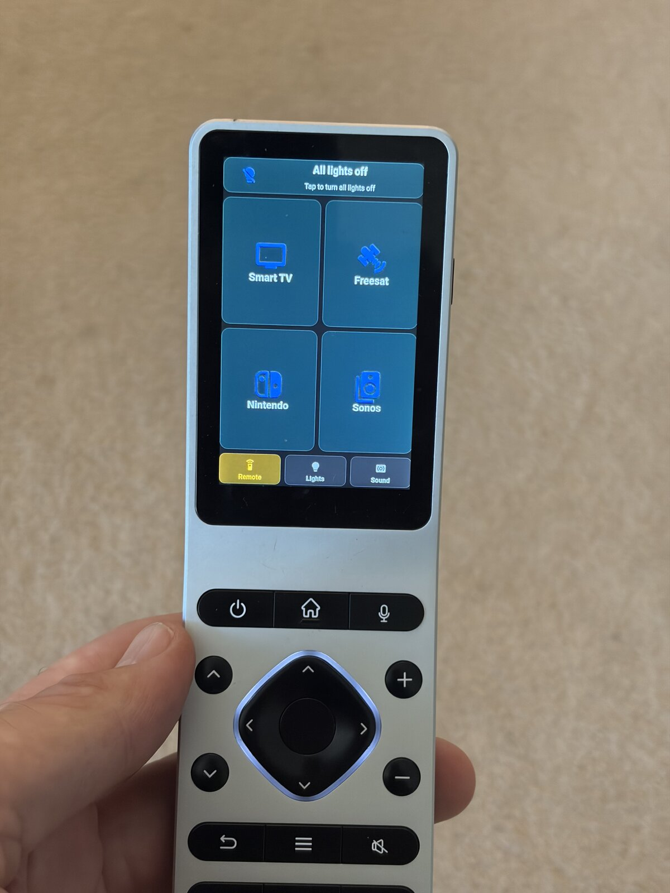
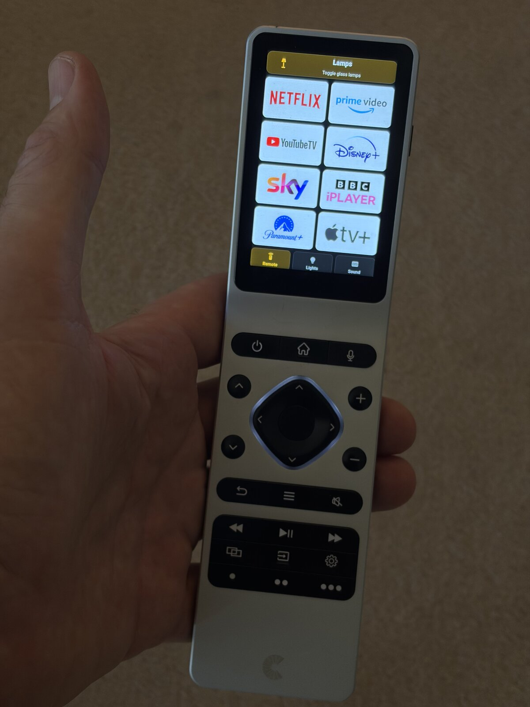
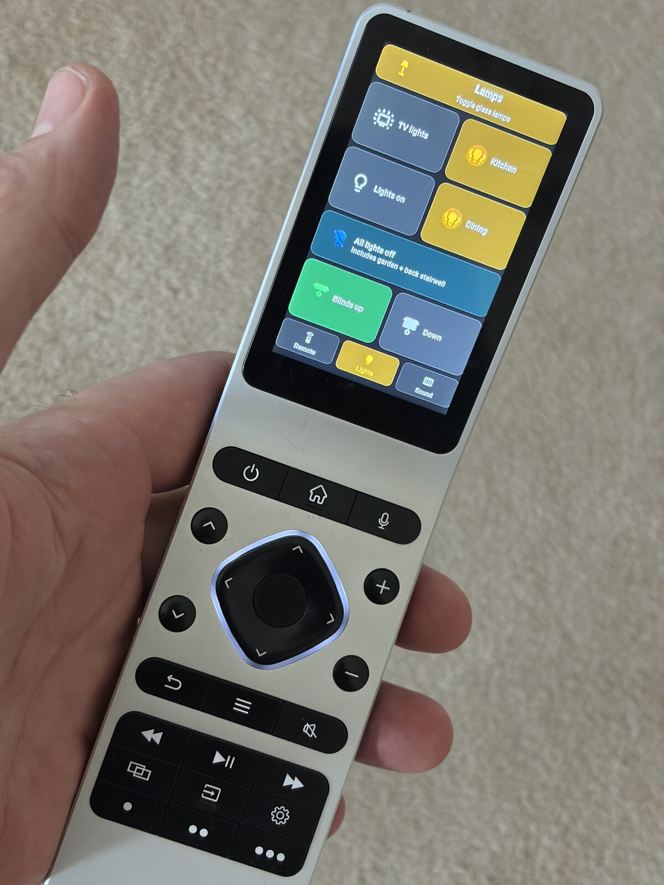

# Haptique RS90 as a Home Assistant remote

The Home Assistant config behind my Haptique RS90 remote. The physical buttons go to Home Assistant over MQTT, and the touchscreen shows a Lovelace dashboard in Fully Kiosk Browser. Haptique's own interface is hardly used.

The full write-up is on my blog: https://peterblandford.com/blog/2026/09/20/haptique-rs90-with-home-assistant/

  

This is my setup, copied out of a working config. It is not a plug-and-play package. The entity ids are mine (LG webOS TV, Yamaha amp, Sonos, a Humax Freesat box, Rako lights) and you will need to change them to yours.

## How it works

Two apps run side by side on the remote:

- The Haptique app looks after the hardware. It sends IR and publishes every button press to `Haptique/YOUR_REMOTE_ID/keys` as `button:N`
- Fully Kiosk Browser sits in front and shows the dashboard

`sensor.family_room_activity` works out what the room is doing (Smart TV, Freesat, Nintendo, Sonos or Off) from the amp, the TV and the Sonos. One automation, `rs90_family_room_buttons`, reads each button press and routes it according to that activity. The dashboard reads the same sensor and shows the matching panel.

## What you need

- An MQTT broker, with MQTT switched on in the Haptique app
- The [Haptique RS90 integration](https://github.com/daangel27/haptique_rs90) by daangel27, from HACS. This provides the ring light button, the restart browser button, the battery sensor and the plugged-in sensor that the automations use. They are not defined in YAML here
- Fully Kiosk Browser on the RS90, with Remote Admin on. I am on 10.5 because 10.6.2 broke my Sonos display
- Button Mapper on the RS90, mapping volume up and down to scroll, so the Android volume slider stays off the screen
- From HACS: [mushroom](https://github.com/piitaya/lovelace-mushroom), [button-card](https://github.com/custom-cards/button-card), [card-mod](https://github.com/thomasloven/lovelace-card-mod), [maxi-media-player](https://github.com/punxaphil/maxi-media-player) and [kiosk-mode](https://github.com/NemesisRE/kiosk-mode)

## Files

```
automations/rs90_automations.yaml   button routing, retained message clear, FK crash alert, battery alerts, display resets
sensors/family_room_activity.yaml   the activity template sensor
helpers/                            input_select, input_boolean and timer helpers
scripts/rs90_scripts.yaml           the activity scripts (TV, Sonos, Freesat, Nintendo, all off)
dashboard/view_RS90.yaml            the view, three fixed zones, 790px high
dashboard/includes/remote/          the panels the view includes
```

The scripts call two of my shared scripts that are not included, `script.pause_downstairs_sonos_if_playing` and `script.downstairs_tv`. Point them at your own or take those steps out.

## Placeholders to replace

| Placeholder | What it is |
|---|---|
| `YOUR_REMOTE_ID` | The id in your remote's MQTT topics, `Haptique/<id>/...` |
| `YOUR_RS90_IP` | The remote's IP address (only used in a notification message) |
| `YOUR_HA_USER_ID_OWNER`, `YOUR_HA_USER_ID_RS90_DEVICE` | The Home Assistant users allowed to see the view. Or delete the `visible:` block |

## Button numbers

| Button | What it does |
|---|---|
| 1 | Power. TV on if the room is off, everything off if it isn't |
| 2 | Home. LG home screen, or back to the Remote tab |
| 4, 11 | Volume up |
| 5, 12 | Volume down |
| 15 | Mute |
| 6, 7, 8, 9 | Up, down, left, right |
| 10 | OK |
| 13 | Back |
| 14 | Menu |
| 16, 17, 18 | Rewind or previous, play/pause, fast forward or next |
| 19 | Nintendo |
| 22 | Show the activity picker |
| 23 | Restart Fully Kiosk Browser |
| 24 | Cycle Remote, Lights, Sound |

The D-pad, OK, Back and Menu go to the TV as webOS buttons. When Freesat is on they are published back to the RS90, which sends the IR command to the Humax.

## Things that caught me out

- Haptique publishes button presses with retain on, so Home Assistant replays the last press on every restart. `clear_rs90_retained_on_ha_start` clears it, and the buttons automation ignores any payload that does not start with `button:`
- If Fully Kiosk has crashed, the restart browser call throws an error and stops the automation. That step has `continue_on_error: true`
- Haptique firmware updates can reset the OPUS1UI setting, and the remote boots to a bare Android app grid. Turn it back on in the Haptique settings
- Fully Kiosk grabs the Back and menu keys before anything else. Back still works, but it also flashes up the Fully Kiosk settings. Not solved

Questions and improvements welcome, open an issue.
